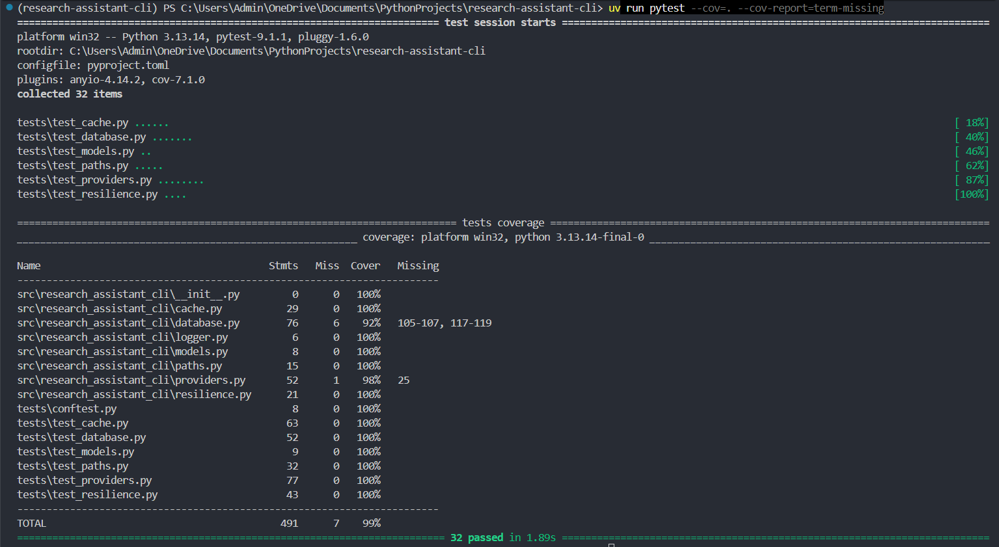

# Research Assistant CLI

A command-line research tool that searches the web across multiple providers, caches results locally, and stores accumulated research for later retrieval — built as a from-scratch Python learning project, architected like production software rather than a script.

Phase 8 (semantic query + LLM-summarized answers over stored research — effectively a RAG agent in miniature) is intentionally deferred and in progress.

## Features

- **Multi-provider web search** with automatic fallback — queries DuckDuckGo and Tavily concurrently, merges and deduplicates results by URL, and degrades gracefully on partial provider failure
- **Resilient by design** — retry-with-backoff wraps all network calls; a single failing provider or a cache read/write error never crashes a search
- **Local caching** via SQLite, with TTL-based expiry to avoid redundant network calls on repeated queries
- **Thread-safe persistence layer** — a dedicated DAL over `sqlite3` with `check_same_thread=False` and an explicit `threading.Lock()` for concurrent access
- **Search history** — every query and its results are stored locally and retrievable later (`--history`, `--find`)
- **Structured logging** to both console and a persistent `app.log` file
- **32 tests, 99% code coverage** across resilience, database, cache, provider, and path-resolution layers, using fakes over mocks for explicit, low-brittleness provider tests
- **Packaged as an installable CLI** via a `pyproject.toml` entry point — `uv tool install .` and run `research-assistant` directly

## Tech Stack

- **Language:** Python 3.13
- **Package/dependency management:** `uv`
- **Persistence:** SQLite (stdlib `sqlite3`)
- **Search providers:** `ddgs`, `tavily-python`
- **HTTP:** `requests`
- **Data handling:** `numpy`, `pandas`
- **Testing:** `pytest`, `monkeypatch`, `tmp_path`, shared `conftest.py` fixtures
- **CI/CD:** GitHub Actions
- **Packaging:** `pyproject.toml` entry point (`hatchling` build backend, `src/` layout)

## Architecture

```
src/research_assistant_cli/
├── main.py           # entry point, sys.argv parsing, command dispatch, sync/async bridge
├── providers.py       # search provider clients (DDG, Tavily) + concurrent multi-provider merge/dedup
├── resilience.py       # retry/backoff decorator used across all network calls
├── cache.py             # @cached_search decorator — cache-key hashing, isolated read/write failure handling
├── database.py            # SQLite DAL — cache table, search/results tables, thread-safe connection handling
├── models.py               # SearchResult dataclass
├── paths.py                 # OS-appropriate data directory resolution (Windows/macOS/Linux)
└── logger.py                 # logging setup (console + app.log file handler)
```

**Design decisions worth knowing:**
- **SQLite over Postgres** — single-user local CLI tool; zero-setup persistence was the right tradeoff over running a database server for a research assistant that lives on one machine.
- **Retry/backoff at the provider boundary, not the CLI boundary** — network flakiness is isolated to where it originates, so a transient DNS blip on one provider doesn't bubble up as a user-facing crash.
- **Fakes over `MagicMock` for provider tests** — hand-written fake clients (`FakeDDGS`, `FakeTavilyClient`) make test intent explicit and catch interface drift that a loose mock would silently swallow.
- **Cache read/write failures are isolated in a decorator, not the DAL** — `cache.py`'s `@cached_search` wraps every provider call so a corrupt cache row or failed write is logged and never fails a search that would otherwise succeed.
- **Config errors fail fast, network errors degrade gracefully** — a missing `TAVILY_API_KEY` raises immediately at provider construction, before any network activity; a mid-search timeout on one provider is caught per-provider and the search continues with whichever providers succeeded.

## Installation

```bash
git clone https://github.com/aayush-github-564/research-assistant-cli.git
cd research-assistant-cli
uv sync
uv tool install .
```

Copy `.env.example` to `.env` and add your Tavily API key:
```bash
TAVILY_API_KEY=your_api_key_here
```

## Usage

```bash
# Run a search (query is a positional argument, no subcommand)
research-assistant "your query here"

# View a past search's results by ID
research-assistant --show <id>

# List the 5 most recent searches
research-assistant --history

# Find past searches matching a keyword
research-assistant --find "keyword"
```

## Testing

```bash
uv run pytest
```

**32 tests passing, 99% coverage** (491 statements, 7 missed) across `cache.py`, `database.py`, `models.py`, `paths.py`, `providers.py`, and `resilience.py`. Test suite covers dataclass equality/repr, retry/backoff exhaustion and non-matching-exception paths, cache hit/miss/expiry/read-write-failure handling, cross-platform path resolution (Windows/macOS/Linux), and provider success/failure/merge/dedup logic. CI runs the full suite via GitHub Actions on every push and pull request to `main`.

```bash
uv run pytest --cov=. --cov-report=term-missing
```

**Coverage report:**



## Known limitations / next steps

- `shutdown_event` mid-save rollback path in `database.py` (lines 105–107, 117–119) is currently untested — the one gap in an otherwise 99%-covered codebase
- `DEFAULT_CACHE_TTL` in `cache.py` is currently set to `5` (seconds) with a stale comment claiming "1 hour" — needs correcting to an intentional value before this is production-shaped
- Third-party `ddgs` library logs at INFO level and floods the console/log file since `logger.py` only calls `logging.basicConfig()` without suppressing dependency loggers — needs `logging.getLogger("ddgs").setLevel(logging.WARNING)` (and its HTTP client) added to `setup_logging()`
- No `--help` or argument validation beyond manual `sys.argv` checks — a real argparse/click-based interface is a natural follow-up
- Phase 8 (embeddings-based semantic query + LLM-summarized answers) is the next milestone

## What this project demonstrates

Built end-to-end in Python as a deliberate transition project (prior background: Java/Spring Boot), covering: resilient network programming, thread-safe local persistence, a real automated test suite (not just happy-path), CI/CD, and packaging — the full lifecycle of a production-shaped CLI tool, not a tutorial script.