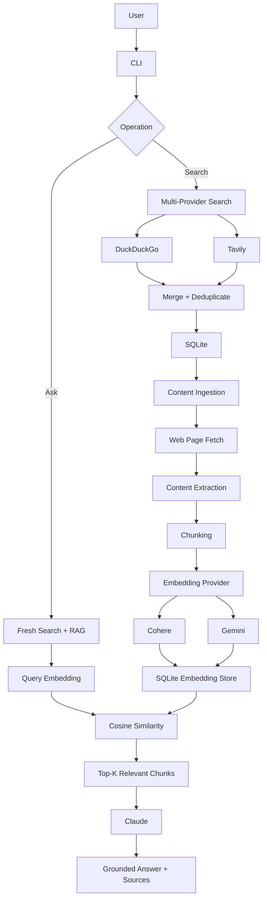
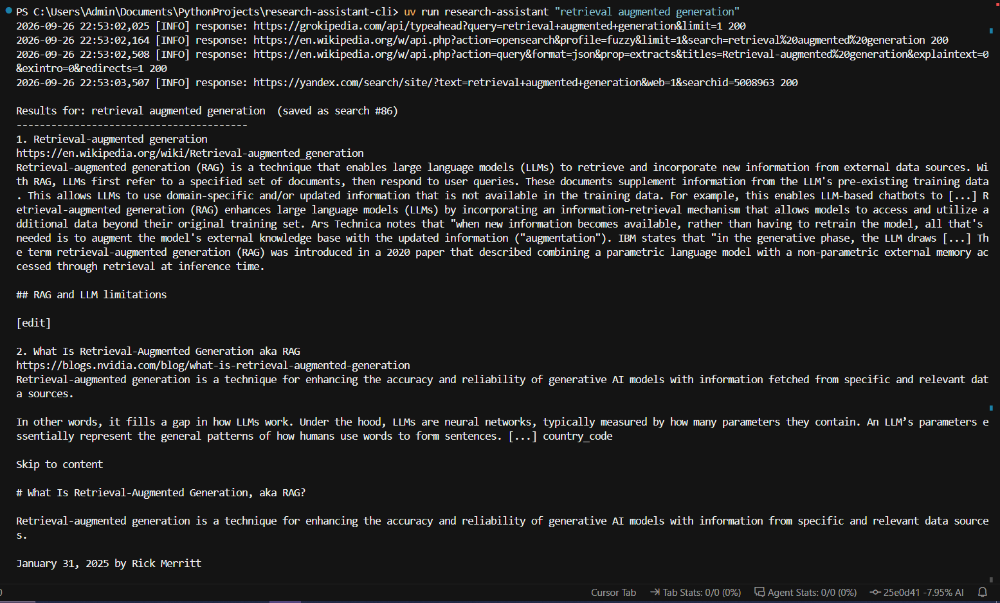
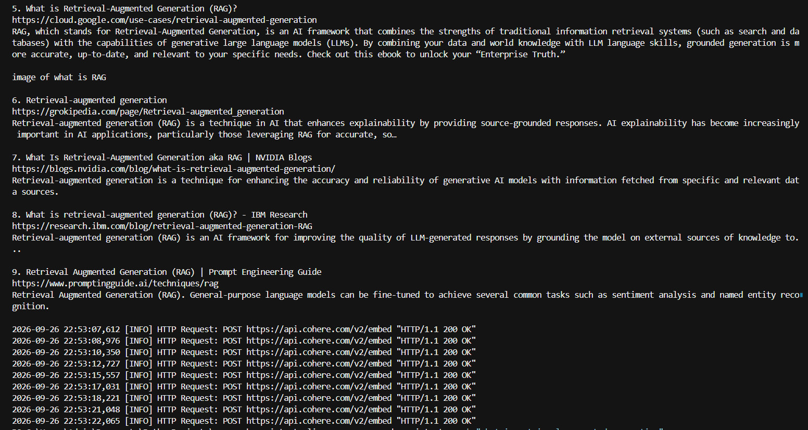
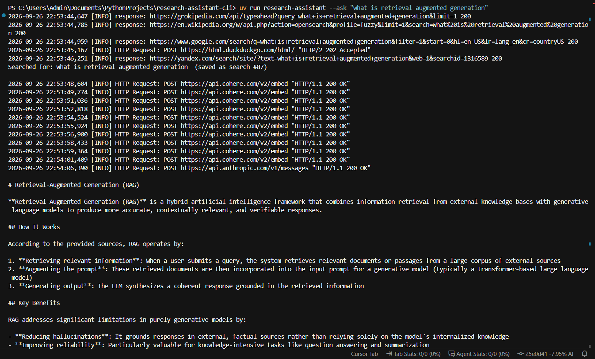
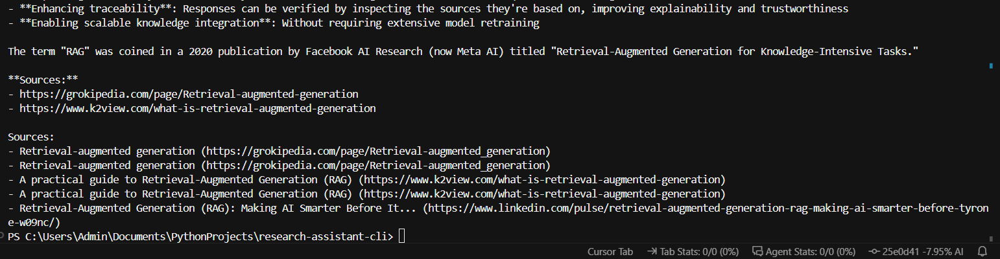

# AI-Powered Research Assistant CLI

> A Python-based research assistant that combines multi-provider web search, local research storage, semantic retrieval, embeddings, and LLM-based synthesis into an end-to-end RAG pipeline.

[](https://www.python.org/)
[](#testing)
[](#rag-pipeline)
[](#license)
<!-- Add a CI badge once you have the workflow filename, e.g.:
 -->

---

## Overview

Research Assistant CLI is an end-to-end AI research system built from scratch in Python — no LangChain, no managed vector database. It began as a resilient multi-provider search CLI and evolved into a full retrieval-augmented generation (RAG) system:

- Searches multiple web providers concurrently (DuckDuckGo, Tavily) and persists results locally in SQLite
- Fetches and extracts full page content, chunks it for retrieval
- Generates embeddings through interchangeable providers (Cohere, Gemini)
- Retrieves relevant context via cosine similarity, with no ANN index or vector DB
- Synthesizes grounded, cited answers with Claude

Core retrieval, persistence, provider abstraction, ingestion, and synthesis are implemented directly rather than delegated to a framework, to keep the AI pipeline explicit and inspectable end to end.

## Quickstart

```bash
git clone https://github.com/aayush-github-564/research-assistant-cli.git
cd research-assistant-cli
uv sync
uv tool install .
cp .env.example .env   # add your API keys — see Configuration below
research-assistant --ask "How does retrieval augmented generation work?"
```

---

## Architecture



### Pipeline stages

| Stage | What happens | Tech |
|---|---|---|
| Search | Queries providers concurrently; a failure in one doesn't block the other | DuckDuckGo, Tavily |
| Ingestion | Fetches each result's page, extracts readable content, falls back to the snippet on failure | `trafilatura` |
| Chunking | Splits content into overlapping word chunks to preserve context across boundaries | 200-word chunks, 40-word overlap |
| Embedding | Converts each chunk into a dense vector behind a common provider interface | Cohere `embed-v4.0`, Gemini `text-embedding-005` |
| Storage | Persists chunk text, source metadata, and the embedding vector; tags vectors by originating model so different embedding spaces are never compared | SQLite BLOBs (NumPy `float32`) |
| Retrieval | Embeds the query, computes cosine similarity against same-provider vectors, returns top-K | NumPy |
| Synthesis | Answers using only retrieved context, cites source URLs, and is instructed to say when context is insufficient | Claude |

<!-- Screenshot: `research-assistant --ask "..."` output showing the
     question, generated answer, and cited source URLs -->





---

## Evaluation & Benchmarks

*(as of Sep 2026 — verified against the current codebase)*

| Metric | Result |
|---|---:|
| Source-level Recall@5 | **80%** (20 manually curated queries, one designated relevant source each) |
| Indexed chunks | **6,760+** |
| Research topics | **74** |
| Search resilience | **38/38** simulated single-provider failure scenarios handled |
| Search deduplication | 400 → 362 unique results (~9.5% reduction) |
| Cache speedup | ~3,130 ms cold → ~0.4 ms warm (~7,800×) |
| Tests | **56/56** passing — ~74% overall coverage, ~96% on core modules |

The recall figure is a project-level retrieval benchmark, not a general corpus-wide IR benchmark: each query has one manually designated relevant source, and a query counts as a hit if that source appears in the top 5 unique sources retrieved. Evaluation scripts live in `scripts/` (`measure_recall.py`, `measure_scale.py`, `measure_cache.py`, `measure_dedup.py`, `measure_resilience.py`).

---

## Project Structure

```text
research-assistant-cli/
├── src/research_assistant_cli/
│   ├── main.py           # CLI entry point and command dispatch
│   ├── providers.py      # DuckDuckGo/Tavily search providers
│   ├── resilience.py     # Retry + exponential backoff
│   ├── cache.py          # SQLite-backed search caching
│   ├── database.py       # Thread-safe SQLite persistence layer
│   ├── content.py        # Web fetching + content extraction + chunking
│   ├── ingestion.py      # Chunking, embedding, and vector persistence
│   ├── embeddings.py     # Cohere/Gemini embedding abstraction
│   ├── retrieval.py      # NumPy cosine-similarity retrieval
│   ├── synthesis.py      # Claude-based answer synthesis
│   ├── models.py         # Search result data models
│   ├── paths.py          # Cross-platform application paths
│   └── logger.py         # Console + file logging
├── scripts/               # Evaluation/benchmark scripts (see above)
├── tests/                  # Automated test suite
├── .github/workflows/       # CI configuration
├── pyproject.toml
├── uv.lock
└── README.md
```

---

## Key Design Decisions

**No LangChain or managed vector database.** Chunking, embedding, vector storage, similarity search, context assembly, and synthesis are implemented explicitly rather than abstracted away, to keep the retrieval pipeline transparent and directly controllable.

**SQLite for everything.** Zero external DB setup, local persistence, transactions, and a simple deployment model — sufficient for the current research corpus, and it stores both structured research data and serialized embedding vectors.

**NumPy for vector retrieval.** The corpus is small enough that an in-memory cosine similarity calculation is simple and transparent: load compatible embeddings, build a matrix, score, sort, return top-K. For significantly larger corpora, this could be extended to an ANN index like HNSW or a dedicated vector DB.

**Multiple embedding providers.** Isolated behind an abstract `EmbeddingProvider` interface (`CohereEmbeddingProvider`, `GeminiEmbeddingProvider`) so the retrieval layer isn't coupled to one vendor. Vectors are tagged with their originating model, and retrieval excludes vectors from a different provider.

---

## Configuration

```env
TAVILY_API_KEY=your_tavily_api_key

COHERE_API_KEY=your_cohere_api_key
GEMINI_API_KEY=your_gemini_api_key

ANTHROPIC_API_KEY=your_anthropic_api_key

EMBEDDING_PROVIDER=cohere   # or: gemini
```

**Requirements:** Python 3.13+, `uv`, and API keys for the providers you want to use.

---

## Commands

```bash
# Search the web — queries providers, merges/dedupes, saves and embeds results
research-assistant "retrieval augmented generation"

# Ask a research question — fresh search, embed, retrieve, synthesize an answer with sources
research-assistant --ask "How does retrieval augmented generation work?"

# View recent searches
research-assistant --history

# View a previous search
research-assistant --show <id>

# Search previous research
research-assistant --find "embeddings"
```

---

## Testing

```bash
uv run pytest
uv run pytest --cov=src/research_assistant_cli --cov-report=term-missing
```

56/56 tests passing (~74% overall coverage, ~96% on core application modules — the CLI entry point pulls the overall number down). GitHub Actions runs the suite on repository changes.

---

## Technology Stack

- **AI/ML** — RAG, text embeddings, semantic search, cosine similarity, Cohere Embed, Gemini Embeddings, Anthropic Claude
- **Backend/Data** — Python, SQLite, NumPy, REST APIs, concurrent provider execution, transactional persistence
- **Search & Ingestion** — DuckDuckGo, Tavily, Requests, Trafilatura
- **Engineering** — pytest, pytest-cov, GitHub Actions, `uv`, Hatchling, `.env` configuration

---

## Current Limitations

- Vector retrieval is exact similarity search — no ANN index (HNSW) or dedicated vector database
- Retrieval evaluation uses a manually curated benchmark, one designated relevant source per query, rather than a large public IR dataset
- LLM synthesis depends on retrieved context and doesn't independently verify claims against the web
- CLI is intentionally lightweight — no interactive UI yet

## Future Improvements

- [ ] Hybrid keyword + vector retrieval
- [ ] HNSW / approximate nearest-neighbor indexing
- [ ] Reranking retrieved chunks
- [ ] Larger automated retrieval evaluation set
- [ ] Streaming LLM responses
- [ ] Web UI for research sessions
- [ ] Evaluation of answer faithfulness and citation accuracy

---

## What This Project Demonstrates

**AI Engineering** — RAG pipeline design, embedding generation, semantic retrieval, vector similarity search, LLM grounding, retrieval evaluation, provider abstraction

**Software Engineering** — modular architecture, concurrent execution, thread-safe persistence, transactional DB operations, retry/backoff, caching, automated testing, CI/CD, CLI packaging

> **Build the AI pipeline explicitly, measure it, and keep the underlying system modular enough to evolve.**

---

## License

MIT License. See `LICENSE` for details.